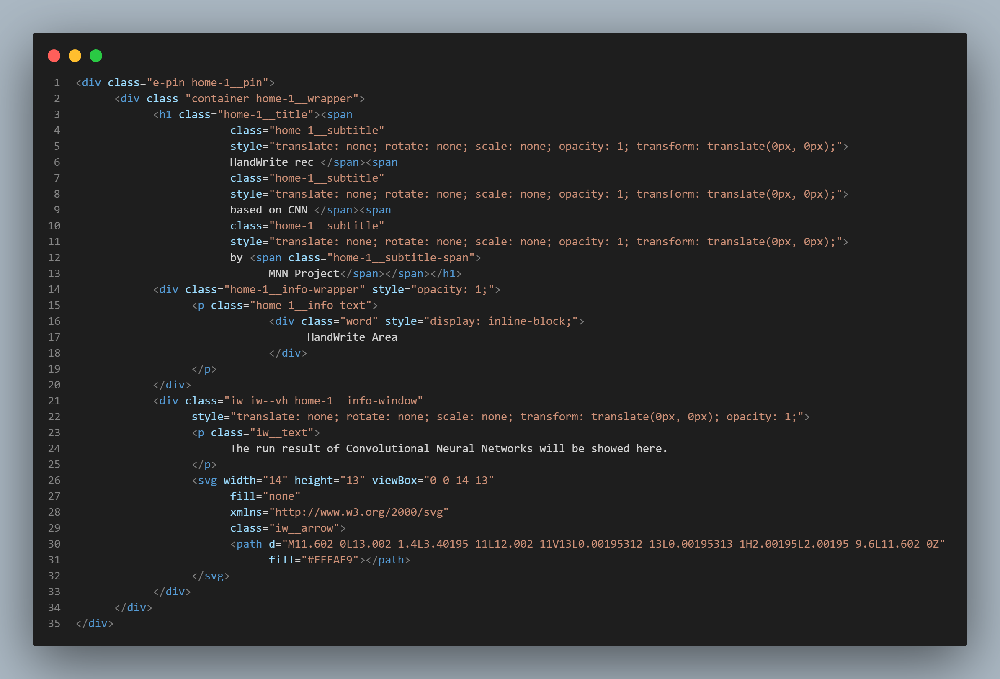
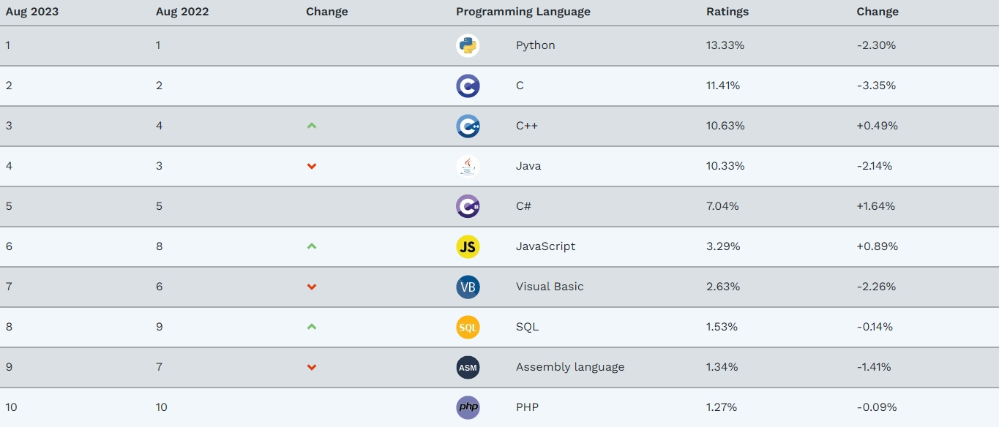

# 基于Le-Net5的卷积神经网络（前端）

## 前言

本项目是基于基于Le-Net5的卷积神经网络的前端工程，为用户操作、网络呈现、数据反馈提供了图形化界面，帮助操作，是MNN Project的重要组成部分。

此自述文件简略描述了本项目的大致内容。

## 1 关于代码

### 1.1 代码详情

项目使用html、css、js（25.2%、34.4%、40.4%）作为程序语言，源码已上传到Github [查看完整代码](https://github.com/raziore/mnn)

还需再提一句的是，如果想运行前端，请使用电脑，并双击cnn.html。

*在以后的版本里，比如真正能运行的完整项目中，可能会需要Node.js并安装相应依赖来作为运行前提*

### 1.2 代码预览

*代码片段01*

*代码片段02*

### 1.3 代码规范

项目使用代码遵循W3C的HTML5、ECMA-262、CSS3标准，请使用支持相关规范的主流浏览器以保证前端正常运行，推荐使用Edge。

一小部分JS属于Module JS，默认使用严格模式，请确保你的浏览器或运行容器与之兼容。

## 2 关于项目

### 2.1 项目详情

本项目的前端部分是开源项目，采用GNU LGPL(GNU Lesser General Public License v2.1)证书，任何人可以查看其源代码。

Theme By aitls(.xyz)

Generator VSCode

Explorer Edge

Editor Raziore

git git@github.com:raziore/mnn.git

### 2.2 为什么是JS

在人们长期以来的广泛认知中，Python和C++、Java是三大编程语言。然而编程语言千千万，适合的才是最好的，没有一种语言是Silver Bullet。

下面附上一张Tiobe的排名：

可以看出，前端语言中有两种进入了前十（分别是JavaScript和PHP）。要知道前端语言只是解释性语言，相比执行性语言本身就要逊色很多。而在Google的V8引擎中，JS更是达到了可以和C++媲美的执行速度。

作为前端语言的JS，既能展现内容，又能处理数据，理所当然地成为了前端和后端链接的一把手。现在全世界的网站服务器都在运行着JS脚本。这使JS成为了本项目前端部分的不二选择。

### 2.3 问题

  1. 顶部bar太高，占用空间太多

  2. 左部手写区域毛玻璃效果边缘太明显

  3. 右部背景文字区分度太高，没有层次感，不利于展示网络

  4. CSS冗余过多，影响渲染速度

  5. 需要额外启用硬件加速

  6.  无法实操

  7.  引进Node.js有困难，但不用它又不行

### 2.4 解决方法

### 2.6 发展方向

## 结语

