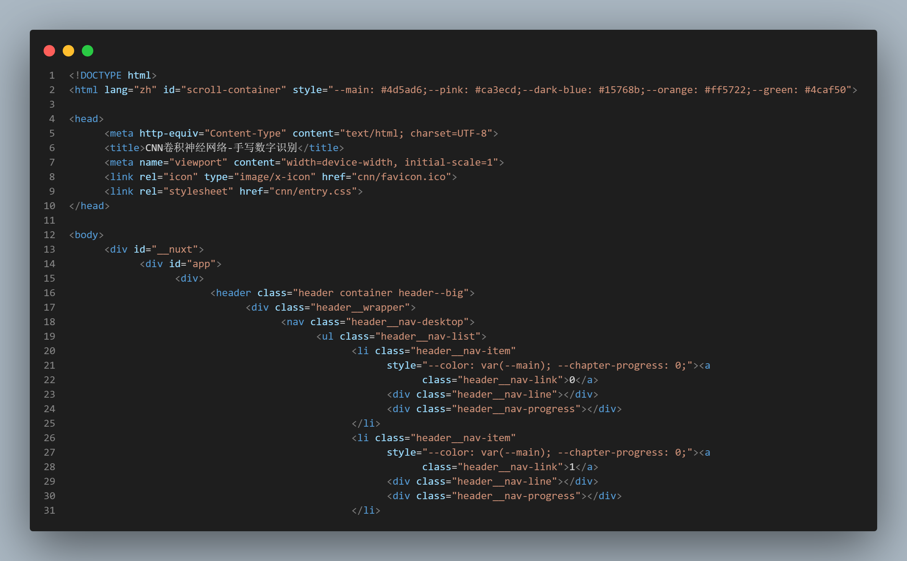

# 基于Le-Net5的卷积神经网络（前端）

## 前言

本项目是基于基于Le-Net5的卷积神经网络的前端工程，为用户操作、网络呈现、数据反馈提供了图形化界面，帮助操作，是MNN Project的重要组成部分。

## 1.1 代码详情

项目使用html、css、js（25.2%、34.4%、40.4%）作为程序语言，源码已上传到Github [查看完整代码](https://github.com/raziore/mnn)

还需再提一句的是，如果想运行前端，请使用电脑，并双击cnn.html。

*在以后的版本里，比如真正能运行的完整项目中，可能会需要Node.js并安装相应依赖来作为运行前提*

